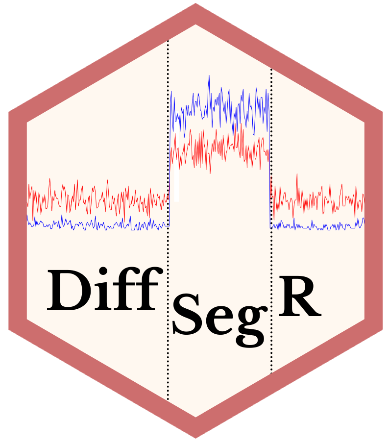

<!-- README.md is generated from README.Rmd. Please edit that file -->

```{r, include = FALSE}
knitr::opts_chunk$set(
  collapse = TRUE,
  comment = "#>",
  fig.path = "man/figures/README-",
  out.width = "100%"
)
```

<!-- badges: start -->
<!-- badges: end -->

# DiffSegR 

## What is DiffSegR ?

The ``DiffSegR`` R package takes the bam files from an RNA-Seq dataset with two 
biological conditions and returns transcriptome-wide expression differences between
these two conditions without using pre-existing annotations (typically genes). 

All the motivations for this method and a comparison with the state-of-the-art 
are described in Liehrmann et al. (2023). Briefly, gaining 
a global picture of gene and RNA regulations requires detailed knowledge of the 
transcriptome along with the enzymatic and RNA-binding activities that shape it.
Hence, several RNA-Seq-based strategies have recently been developed to decipher
its complexity. However, most of the tools developed only count the abundance 
of sequencing reads along annotated regions. These annotations 
are typically incomplete and often lead to errors in the differential expression
analysis.  

In the context of differential expression analysis, the regulations of genes 
and RNAs result in local changes of the log2 fold change (log2-FC) along the 
genome, i.e the differential transcription profile. Therefore, one can use a multiple 
changepoint detection algorithm such as ``fpop`` (Maidstone et al. 2017) to delineate 
the boundaries of the differentially expressed regions (DERs) without relying on 
pre-existing annotations. The DERs can then be assessed using, for example, the 
negative binomial generalized linear model of ``DESeq2`` (Love et al. 2014).

The `DiffSegR` R package, an identify then annotate tool, implements this strategy.


## How can I get DiffSegR ?

Make sure that `remotes` is installed by running `install.packages("remotes")`,
then type

``` r
remotes::install_github("aLiehrmann/DiffSegR")
```

## Where can I learn more?

See the [introductory tutorial](https://aliehrmann.github.io/DiffSegR/articles/introductory_tutorial.html) for an 
introduction to our framework on real data. See the 
[advanced tutorial](https://aliehrmann.github.io/DiffSegR/articles/advanced_uses.html) for examples of 
more advanced uses of `DiffSegR`. If you're interested in analyzing multiple 
loci, including entire chromosomes, after reading the introduction, go take a look at 
our [Multi-loci analysis](https://aliehrmann.github.io/DiffSegR/articles/multi_loci.html) vignette.

## References 

Liehrmann, A., Delannoy, E., Castandet, B. and Rigaill, G. DiffSegR: an
RNA-Seq data driven method for differential expression analysis using 
changepoint detection (2023) [doi:10.1093/nargab/lqad098](https://doi.org/10.1093/nargab/lqad098).

Maidstone R, Hocking T, Rigaill G, Fearnhead P. On optimal multiple 
changepoint algorithms for large data. Stat Comput 27(2), 519-533 (2017)
[doi:10.1007/s11222-016-9636-3](https://link.springer.com/article/10.1007/s11222-016-9636-3).

Love, M.I., Huber, W. & Anders, S. Moderated estimation of fold change and 
dispersion for RNA-seq data with DESeq2. Genome Biol 15, 550 (2014) 
[doi:10.1186/s13059-014-0550-8](https://genomebiology.biomedcentral.com/articles/10.1186/s13059-014-0550-8).


